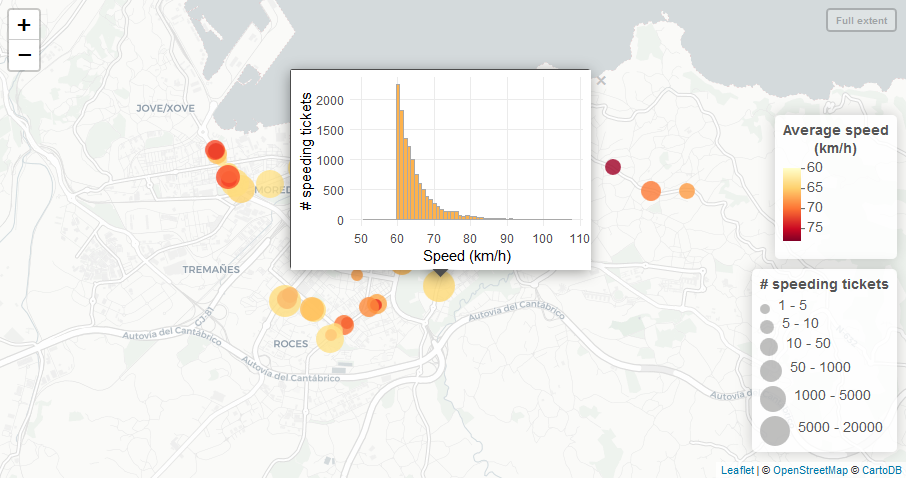
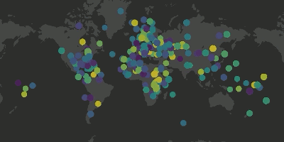

```{r setup, include=FALSE}
options(htmltools.dir.version = FALSE)

library(knitr)
opts_chunk$set(message = FALSE, warning = FALSE, 
               fig.height = 6, fig.width = 8, fig.align = "center", 
               out.width = '100%') #out.height = '400px')
```

```{css, echo=FALSE}
.remark-slide-content {
  padding-top: 0px;
}


.remark-code {
  font-size: 13px;
}

.code10 .remark-code {
  font-size: 10%;
}

.code20 .remark-code {
  font-size: 20%;
}

.code30 .remark-code {
  font-size: 30%;
}

.code40 .remark-code {
  font-size: 40%;
}

.code50 .remark-code {
  font-size: 50%;
}

.code60 .remark-code {
  font-size: 60%;
}

.code70 .remark-code {
  font-size: 70%;
}

.code80 .remark-code {
  font-size: 80%;
}

.code90 .remark-code {
  font-size: 90%;
}
```

---
class: inverse, center, middle

# Mapping point data

---

## Palm trees in Sevilla

```{r echo=FALSE}

library("dplyr")

palms <- readr::read_csv("data/Parques_y_Jardines_Palmera_Viario.csv", na = 'NULL')
names(palms) <- c("X", "Y", "xlo", "ylo", "spcode", "species", "perimeter", "height", "id")
palms$height <- as.numeric(palms$height)
palms <- dplyr::sample_n(palms, 200)
kable(head(palms[, c(1, 2, 6:8)]), format = "html")
```

Source: http://sevilla-idesevilla.opendata.arcgis.com/datasets/778759ea5f3243dd91225605e79a66c6_0


---

## Make interactive map (leaflet)

```{r}
library("leaflet")
```

https://rstudio.github.io/leaflet

([Cheatsheet](https://github.com/rstudio/cheatsheets/raw/master/leaflet.pdf))


---

## Make interactive map (leaflet)

```{r}
leaflet(palms) %>%
  addTiles() %>%
  addMarkers(lng = ~X, lat = ~Y)
```

---

## Hey those are palm trees!

```{r}
palm.icon <- makeIcon("https://img.icons8.com/ios-glyphs/30/000000/palm-tree.png")

leaflet(palms) %>%
  addTiles() %>%
  addMarkers(lng = ~X, lat = ~Y, icon = palm.icon)
```

<a href="https://icons8.com/icon/104106/palm-tree">Palm Tree icon by Icons8</a>


---

## Make point clusters

```{r}
leaflet(palms) %>%
  addTiles() %>%
  addMarkers(lng = ~X, lat = ~Y, icon = palm.icon, 
             clusterOptions = markerClusterOptions())  #<<
```

---

## Maybe just circles?

```{r}
leaflet(palms) %>%
  addTiles() %>%
  addCircleMarkers(lng = ~X, lat = ~Y, 
                   radius = 5, stroke = FALSE, fillOpacity = 0.7) 
```


---
class: inverse, center, middle

# Changing basemaps


---

## Default tiles: OpenStreetMap

```{r}
leaflet(palms) %>%
  addTiles() %>%  #<<
  addCircleMarkers(lng = ~X, lat = ~Y, 
                   radius = 5, stroke = FALSE, fillOpacity = 0.7)
```


---

## Using other tile providers

```{r}
leaflet(palms) %>%
  addProviderTiles(provider = providers$Esri.WorldImagery) %>%   #<<
  addCircleMarkers(lng = ~X, lat = ~Y, radius = 5, stroke = FALSE, fillOpacity = 0.7)
```


---

## Using other tile providers

```{r}
leaflet(palms) %>%
  addProviderTiles(provider = providers$Stamen.Watercolor) %>%  #<<
  addCircleMarkers(lng = ~X, lat = ~Y, radius = 5, stroke = FALSE, fillOpacity = 0.7)
```


---

## Using other tile providers

```{r}
leaflet(palms) %>%
  addProviderTiles(provider = providers$CartoDB.Positron) %>%   #<<
  addCircleMarkers(lng = ~X, lat = ~Y, radius = 5, stroke = FALSE, fillOpacity = 0.7)
```


---

## Using WMS tiles

```{r}
leaflet(palms) %>%
  addWMSTiles(baseUrl = "http://www.ign.es/wms-inspire/ign-base", #<<
              layers = "IGNBaseTodo-nofondo") %>%   #<<
  addCircleMarkers(lng = ~X, lat = ~Y, radius = 5, stroke = FALSE, fillOpacity = 0.7)
```


---
class: inverse, center, middle

# Adding information to points

---

## Point size ~ palm height

```{r}
leaflet(palms) %>%
  addProviderTiles(providers$CartoDB.Positron) %>%
  addCircleMarkers(lng = ~X, lat = ~Y, stroke = FALSE, 
                   radius = ~height) #<<
```


---

## Point colour ~ palm height

```{r}
pal <- colorNumeric(palette = "YlOrRd", domain = palms$height)  #<<
leaflet(palms) %>%
  addProviderTiles(providers$CartoDB.Positron) %>%
  addCircleMarkers(lng = ~X, lat = ~Y, 
                   stroke = FALSE, radius = 6, fillOpacity = 0.8,
                   color = ~pal(height))  #<<
```


---

## Add legend

```{r}
leaflet(palms, height = '400px') %>%
  addProviderTiles(providers$CartoDB.Positron) %>%
  addCircleMarkers(lng = ~X, lat = ~Y, stroke = FALSE, radius = 6, 
                   color = ~pal(height), fillOpacity = 0.7) %>%
  addLegend(position = "bottomright",  #<<
            pal = pal, values = ~height, opacity = 1)  #<<
```


---

## Point colour ~ palm genus (factor)

```{r echo=FALSE}
library("stringr")
palms <- mutate(palms, genus = case_when(
  str_detect(species, "Phoenix") ~ "Phoenix",
  str_detect(species, "Washingtonia") ~ "Washingtonia",
  # str_detect(species, "Yucca") ~ "Yucca",
  # str_detect(species, "Chamaerops") ~ "Chamaerops",
  # str_detect(species, "Trachycarpus") ~ "Trachycarpus",
  TRUE ~ "Other"
)) %>%
  mutate(genus = factor(genus, levels = c("Phoenix", "Washingtonia", "Other")))
```


```{r}
pal.gen <- colorFactor(palette = "Dark2", domain = palms$genus)   #<<

leaflet(palms, height = '400px') %>%
  addProviderTiles(providers$CartoDB.Positron) %>%
  addCircleMarkers(lng = ~X, lat = ~Y, stroke = FALSE, radius = 6, 
                   color = ~pal.gen(genus), fillOpacity = 0.7) %>%
  addLegend(position = "bottomright", pal = pal.gen, values = ~genus, opacity = 1) 
```


---

## Focus on particular area

```{r}
leaflet(palms, height = '400px') %>%
  addProviderTiles(providers$CartoDB.Positron) %>%
  addCircleMarkers(lng = ~X, lat = ~Y, stroke = FALSE, radius = 8, 
                   color = ~pal.gen(genus), fillOpacity = 0.7) %>%
  addLegend(position = "bottomright", pal = pal.gen, values = ~genus, opacity = 1) %>%
  setView(lng = -6, lat = 37.38, zoom = 15) # see also fitBounds #<<
```


```{r eval=FALSE, echo=FALSE}
## Adding labels
  
leaflet(palms, height = '400px') %>%
  setView(lng = -6, lat = 37.38, zoom = 15) %>%
  addProviderTiles(provider = providers$CartoDB.Positron) %>%
  addCircleMarkers(lng = ~X, lat = ~Y, stroke = FALSE, radius = 8, 
                   color = ~pal.gen(genus), fillOpacity = 0.7,
                   label = ~species) %>%    #<<
  addLegend(position = "bottomright", pal = pal.gen, values = ~genus, opacity = 1)
```


---

## Adding popups

```{r}
leaflet(palms, height = '400px') %>%
  setView(lng = -6, lat = 37.38, zoom = 15) %>%
  addProviderTiles(provider = providers$CartoDB.Positron) %>%
  addCircleMarkers(lng = ~X, lat = ~Y, stroke = FALSE, radius = 8, 
                   color = ~pal.gen(genus), fillOpacity = 0.7,
                   popup = ~species)  #<<
```


---
class: inverse, middle, center

# Advanced popups with `leafpop`

https://github.com/r-spatial/leafpop


---

## Show tables with extra information

```{r echo=FALSE}
library("leafpop")
```


```{r}
leaflet(palms, height = '400px') %>%
  setView(lng = -6, lat = 37.38, zoom = 15) %>%
  addProviderTiles(providers$CartoDB.Positron) %>%
  addCircleMarkers(lng = ~X, lat = ~Y, stroke = FALSE, radius = 8, 
                   color = ~pal.gen(genus), fillOpacity = 0.7,
                   popup = ~leafpop::popupTable(palms,   #<<
                                       zcol = c("species", "perimeter", "height"),  #<<
                                       row.numbers = FALSE, feature.id = FALSE))   #<<
```


---

## Popups can show images, videos, anything!

```{r echo=FALSE}
palms.redux <- palms %>%
  sample_n(5) %>%
  mutate(pics = case_when(
  genus == "Phoenix" ~ paste0(getwd(), "/data/Phoenix.jpg"),
  genus == "Washingtonia" ~ paste0(getwd(), "/data/Washingtonia.jpg"),
  genus == "Other" ~ paste0(getwd(), "/data/palms.jpg")
))
```


```{r eval=TRUE}
leaflet(palms.redux) %>%
  addProviderTiles(providers$CartoDB.Positron) %>%
  addCircleMarkers(lng = ~X, lat = ~Y, stroke = FALSE, radius = 8, 
                   color = ~pal.gen(genus), fillOpacity = 0.7,
                   popup = ~leafpop::popupImage(img = palms.redux$pics,  #<<
                                       src = "local", embed = TRUE)) #<<

```


---

## Popups can show images, videos, anything!

```{r eval=TRUE, echo=FALSE}
gifs <- c(paste0(getwd(), "/data/comorl_redux.gif"), 
          paste0(getwd(), "/data/chiquito_redux.gif"))
leaflet(palms[1:2,]) %>%
  addProviderTiles(providers$CartoDB.Positron) %>%
  addCircleMarkers(lng = ~X, lat = ~Y, stroke = FALSE, radius = 8, fillOpacity = 1,
                   popup = ~leafpop::popupImage(img = gifs,
                                       src = "local", embed = TRUE)) 
```


---

## R graphics as popups

```{r echo=FALSE}

```

https://pakillo.github.io/R-Asturias-DataViz-Contest/speedmap.html


---
class: inverse, middle, center

# Mapping several layers


---

## Show/hide layers (data or basemaps)

```{r echo=FALSE}
phoenix <- dplyr::filter(palms, genus == "Phoenix")
washingtonia <- dplyr::filter(palms, genus == "Washingtonia")
```


```{r}
leaflet(height = '400px') %>%
  addProviderTiles(providers$CartoDB.Positron) %>%
  addCircleMarkers(data = phoenix, group = "Phoenix", #<<
                   lng = ~X, lat = ~Y, stroke = FALSE, radius = 6, 
                   color = ~pal.gen(genus), fillOpacity = 0.7) %>%
  addCircleMarkers(data = washingtonia, group = "Washingtonia", #<<
                   lng = ~X, lat = ~Y, stroke = FALSE, radius = 6, 
                   color = ~pal.gen(genus), fillOpacity = 0.7) %>%
  addLayersControl(overlayGroups = c("Phoenix", "Washingtonia"),  #<<
                   options = layersControlOptions(collapsed = FALSE))
  
```


---
class: inverse, middle, center

# Small multiples of leaflet maps with `leafsync`

https://github.com/r-spatial/leafsync

---

## Let's build two leaflet maps

```{r}
phoenix.map <- leaflet() %>%
  addProviderTiles(providers$CartoDB.Positron) %>%
  addCircleMarkers(data = phoenix, #<<
                   lng = ~X, lat = ~Y, stroke = FALSE, radius = 6, 
                   color = ~pal.gen(genus), fillOpacity = 0.7) 
```


```{r}
washingtonia.map <- leaflet() %>%
  addProviderTiles(providers$CartoDB.Positron) %>%
  addCircleMarkers(data = washingtonia, #<<
                   lng = ~X, lat = ~Y, stroke = FALSE, radius = 6, 
                   color = ~pal.gen(genus), fillOpacity = 0.7) 
```


---

## Synchronised small multiples!

```{r}
leafsync::sync(phoenix.map, washingtonia.map)
```


---
class: inverse, middle, center

# Mapping other spatial data


---

## Data can be

.pull-left[
- Points
- Lines
- Polygons
- Rasters
]

.pull-right[
- Matrix/Dataframe
- sp
- sf
- GeoJSON/TopoJSON
- raster
]

---

## Sevilla neighbourhoods

```{r echo=1}
barrios <- sf::st_read("data/barrios.shp")
head(barrios)
```


Source: http://sevilla-idesevilla.opendata.arcgis.com/datasets/38827fc3eac142149801c2efa2a0bdf9_0


---

## Mapping polygons

```{r}
leaflet(barrios) %>%
  addTiles() %>%
  addPolygons(label = ~Barrio)
```


---

## mapview: quick leaflet maps of any spatial data

```{r}
mapview::mapview(barrios)
```

https://r-spatial.github.io/mapview/


---

## For big datasets, try 

https://github.com/r-spatial/leafgl

https://symbolixau.github.io/mapdeck/

```{r echo=FALSE}

```


---
class: inverse, middle, center

# There are hundreds of [leaflet plugins](https://leafletjs.com/plugins)

(not all implemented in R yet)

---

## Add MiniMap

```{r}
leaflet(barrios) %>%
  addProviderTiles(providers$CartoDB.Positron) %>%
  addPolygons() %>%
  addMiniMap()  #<<
```


---

## Measure distances

```{r}
leaflet(barrios) %>%
  addProviderTiles(providers$CartoDB.Positron) %>%
  addPolygons() %>%
  addMeasure()   #<<
```


---

## Locate me (using Javascript)

```{r}
leaflet(barrios) %>%
  addProviderTiles(providers$CartoDB.Positron) %>%
  addPolygons() %>%
  addEasyButton(easyButton(   #<<
    icon = "fa-crosshairs", title = "Locate Me",   #<<
    onClick = JS("function(btn, map){ map.locate({setView: true}); }")))  #<<
```


---

## Search places

```{r}
library("leaflet.extras")

leaflet(barrios) %>%
  addProviderTiles(providers$CartoDB.Positron) %>%
  addPolygons() %>%
  addSearchOSM()   #<<
```


---

## Add reverse search

```{r}
leaflet(barrios) %>%
  addProviderTiles(providers$CartoDB.Positron) %>%
  addPolygons() %>%
  addReverseSearchOSM()  #<<
```


---

## Animated maps

```{r}
library("leaflet.minicharts")
```


```{r echo=FALSE}
data("eco2mix")
prod2016 <- eco2mix %>%
  mutate(
    renewable = bioenergy + solar + wind + hydraulic,
    non_renewable = total - bioenergy - solar - wind - hydraulic
  ) %>%
  filter(grepl("2016", month) & area != "France") %>%
  select(-month) %>%
  group_by(area, lat, lng) %>%
  summarise_all(sum) %>%
  ungroup()
prodRegions <- eco2mix %>% filter(area != "France")
colors <- c("#3093e5", "#fcba50", "#a0d9e8")

leaflet() %>%
  addTiles("http://server.arcgisonline.com/ArcGIS/rest/services/Canvas/World_Light_Gray_Base/MapServer/tile/{z}/{y}/{x}") %>%
  addMinicharts(
    prodRegions$lng, prodRegions$lat, 
    chartdata = prodRegions[, c("hydraulic", "solar", "wind")],
    time = prodRegions$month,
    transitionTime = 50,
    colorPalette = colors,
    width = 45, height = 45
  )
```


---

## END


Slides and source code available at https://github.com/Pakillo/r-leaflet-maps
